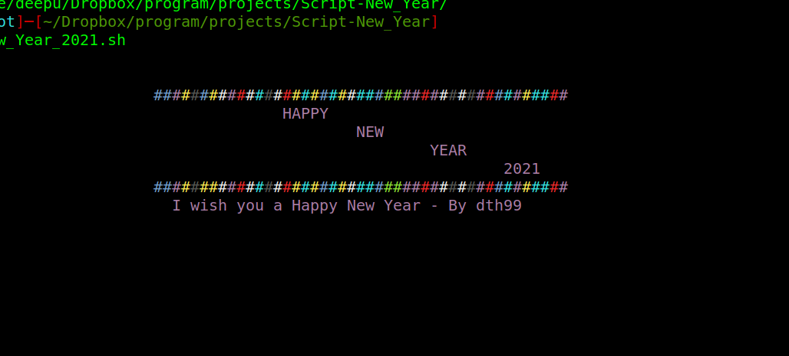

## Script New Year 



## Requirements

This script requires 'toilet' and a bash shell : use command

```bash
sudo apt install toilet
```

## Execution:

```bash
cd Script-New_Year
```

```bash
bash New_Year_2021.sh
```
